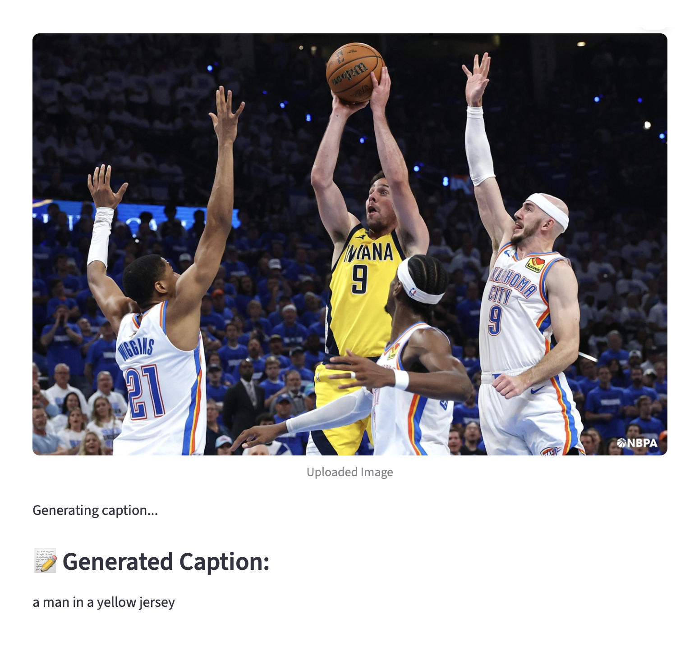

# Image Caption Generator Assignment Report

### Group 10 – Deebak, Andreea, Tsehynesh

---

## Overview

This task involved running a pre-built Python/Streamlit application inside Google Colab to implement an Image Caption Generator using the BLIP (Bootstrapping Language-Image Pre-training) model. The purpose was to understand the workflow of how image captioning app using Gen AI model works, understand model integration within a Streamlit UI.

---

## Code

The provided code builds a functional image-captioning web application using open-source libraries. It demonstrates key concepts such as model loading, UI creation using Streamlit, and web exposure via ngrok.

### 1. Environment Setup

The environment is prepared by cleaning previous background processes and installing required libraries. Tools such as Streamlit, Transformers, PIL, and Pyngrok are used for:

- building the user interface  
- loading and running the BLIP model  
- handling and processing images  
- exposing the Streamlit app to a public URL  

Ngrok is authenticated and used to create a public tunnel to the Streamlit app running on port 8501.

### 2. Model Loading

Inside the Streamlit application, the BLIP model components (the processor and the caption generation model) are loaded using the Salesforce BLIP image captioning base model. These components work together to convert the uploaded image into embeddings and then generate natural-language captions.

### 3. Application Execution

The user interface is structured to:

- allow the user to upload an image  
- preview the uploaded image  
- automatically run the caption-generation model  
- display the resulting caption  

| Component | Role in Code | Model Used |
|----------|--------------|------------|
| User Interface | Accepts images and displays output | Streamlit |
| Image Processing | Converts image for model input | PIL |
| Caption Generation | Produces the text description | BLIP (Salesforce Base) |

---

## Experiment

### 1. Example Caption: NBA Game image

**Analysis:**  
The model's behavior is due to its lack of specialized sports domain training. It defaults to identifying only the most visually prominent, low-risk feature (the yellow jersey) to maximize confidence. Consequently, it ignores the complex action (the contested shot) and all surrounding players and context.

---

### 2. Example Caption: Eiffel Tower

**Analysis:**  
The Eiffel Tower is a globally recognized, high-confidence landmark that is heavily represented in common training datasets. The model correctly identifies and names the most visually dominant, high-confidence object, demonstrating its strength in general object and landmark recognition.

---

## Learnings

BLIP is effective at generating coherent and relevant captions for images, especially when:

- the main subject is prominent  
- the environment is simple or easily identifiable  
- the action is clear  

However, BLIP from our experimentes we found that it may miss:

- fine-grained visual details  
- textual elements within the image  
- complex interactions  
- subtle artistic styles  

The integration of BLIP with Streamlit and Ngrok provides a practical way to deploy real-time computer vision applications through a web browser. This assignment strengthened our understanding of building interactive AI tools using Streamlit and Hugging Face.

These insights will be applied to our final project, where we will use Streamlit to develop the user interface of our meeting summarizer application, including features for URL input, sending email summaries, and adding events to the calendar.

