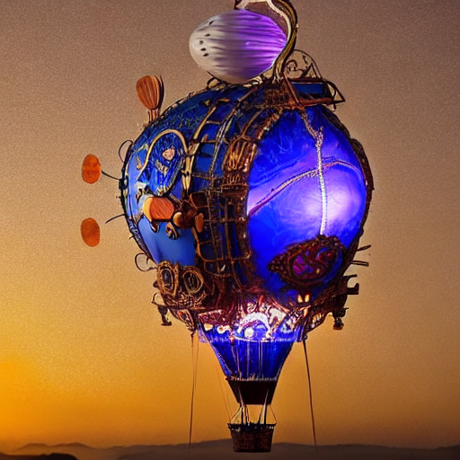

## Speech-to-Image Generation Assignment Report

### Group 10 - Deebak, Andreea, Tsehynesh

### Overview

This assignment involved utilizing a pre-built Python/Streamlit application, running in a Google Colab environment, to execute an **Speech-to-Image generation pipeline**. The core task was to understand the integration of different AI models and evaluate the effectiveness of complex text prompts on the resulting visual output from the Text-to-Image synthesis stage.

### Code Analysis

The provided code establishes a functional AI application using readily available open-source models:

1.  **Environment Setup:** Packages like `pyngrok` and `streamlit` were used to create a publicly accessible web interface, which is a common practice for running local web apps in cloud environments like Colab.
2.  **Model Loading:** The application loads two key AI models:
    * **Speech-to-Text :** `openai/whisper-tiny` is loaded to handle the initial conversion of uploaded audio files into a text prompt.
    * **Text-to-Image :** `runwayml/stable-diffusion-v1-5` is loaded to take the transcribed (or manually entered) text and synthesize a corresponding image.
3.  **Execution:** The app handles user input (audio or text) and executes the `sd_model()` function with configurable parameters like `num_inference_steps` (quality) and `guidance_scale` (prompt strength).

| Component | Role in Code | Model Used |
| :--- | :--- | :--- |
| **User Interface** | Provides input methods (audio upload, text area) | Streamlit |
| **Transcription** | Converts audio to a string for the T2I model | `openai/whisper-tiny` |
| **Image Synthesis** | Generates the visual output | `runwayml/stable-diffusion-v1-5` |

---

### Experiment

The experiment focused on how well the Stable Diffusion model interpreted highly detailed, multi-element prompts, specifically for complex subjects.

#### Prompt Used:
1.  **A hyper-realistic portrait of a Cyberpunk Medusa. Her hair is composed of writhing, glowing fiber-optic cables in neon green and violet. Her skin is matte porcelain with gold circuitry inlays running down her neck. She is standing in a rainy, futuristic Tokyo alleyway at night, with neon signs reflecting off the wet pavement. Cinematic lighting, shallow depth of field, bokeh effect, 8k resolution, Unreal Engine 5 render style.**

---

#### 1. Cyberpunk Medusa Result

| Image | Description |
| :---: | :--- |
|  | The model successfully prioritizes the **primary subject** ("Cyberpunk Medusa") and the **key color palette** (neon green hair, purple lighting). The concept of **fiber-optic cables** is interpreted as rigid, stylized coils near her head. However, the model significantly simplified the environmental and textural details: the **"rainy, futuristic Tokyo alleyway"** and **"neon signs"** were reduced to a simple, abstract purple neon background, and the requested **"gold circuitry inlays"** and **"matte porcelain skin"** are largely absent or generalized. The final image leans toward digital illustration rather than the requested **"hyper-realistic"** quality. |

---

#### 2. Steampunk Whale Hot Air Balloon Result

| Image | Description |
| :---: | :--- |
|   | This image, generated from a separate complex prompt, illustrates a common difficulty with object fusion. While the **steampunk aesthetic** (bronze, gears, mechanical rigging) and the **sunset lighting** were successfully rendered, the model failed to combine the **"whale shape"** with the **"hot air balloon"**. It instead generated a standard, spherical balloon with mechanical accessories. Furthermore, the detailed environmental feature—the **"bioluminescent coral reef"** beneath the ocean—was not rendered in the final image, suggesting that the model often drops complex background elements when the primary subject is already highly detailed. |

---

### Learnings

Stable Diffusion v1.5 effectively captures both the subject and the artistic style, such as cyberpunk, steampunk, or digital painting, when given a detailed prompt. The integration of Whisper and Stable Diffusion within a Streamlit application demonstrates a powerful and functional prototype for a voice-controlled generative AI tool, even though the image model still has some limitations in interpreting very fine-grained details.

Overall, this assignment helped us understand how to build a simple generative AI web application using Streamlit as the framework and Hugging Face as the model hub, and it has given us confidence to develop similar tools for my own use cases. Using this approach, we plan to develop our final project’s user interface with Streamlit. Our meeting summarizer application will require a UI that allows users to enter a URL, send an email, and add the meeting to their calendar. Streamlit provides the components and structure we need to build these features effectively.
